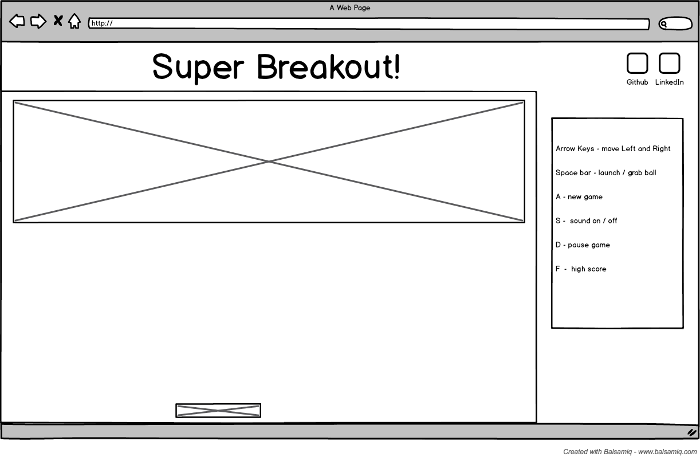

## Breakout

### Background

Breakout is a classic single player arcade game in which a layer of bricks lines the top third of the screen. A ball travels across the screen, bouncing off the top and side walls of the screen. When a brick is hit, the ball bounces away and the brick is destroyed. The player loses a turn when the ball touches the bottom of the screen. To prevent this from happening, the player has a movable paddle to bounce the ball upward, keeping it in play. The player completes the current level when all bricks have been destroyed.

There have been many sequels to the original game with various tweaks to the formula. This version will implement some of as outlined in the **Functionality & MVP** and **Bonus Features** sections.  

### Functionality & MVP  

Users will be able to:

- [ ] Start, pause, reset the game
- [ ] Use arrow keys to manipulate the paddle left and right
- [ ] Advance through increasingly difficult levels

In addition, this project will include:

- [ ] A sidebar describing the controls of the game
- [ ] A production Readme

### Wireframes

The game's window will resemble a retro handheld device. Basic controls will be always present in the right margin. Initial game state will prompt the user to press the enter when ready to launch the ball from the paddle. Difficulty will be controlled by speed of the ball and the number  and structure of the bricks.

### Architecture and Technologies

This game will make use of the following technologies:

- Vanilla JavaScript and for overall structure and game logic,
- `HTML5 Canvas` for DOM manipulation and rendering,
- Webpack to bundle and serve up the various scripts.

### Implementation Timeline

**Day 1**: Get webpack up and running start learning Canvas.  Create `webpack.config.js` as well as `package.json`. Set up container margins with game controls.

**Day 2**: Learn `Stage.js` and get bricks with styling to render on the screen.  Create eventListeners key movement and get paddle to correspond with key press.

**Day 3**: Work on game logic and physics. Possibly start to work on difficulty types

**Day 4**: Continue work on logic and level structure. Finishing design choices and add instructions

### Bonus features

- [ ] Add upgrades to paddle (width) and additional ball upgrages
- [ ] Add multiple choices difficulty
