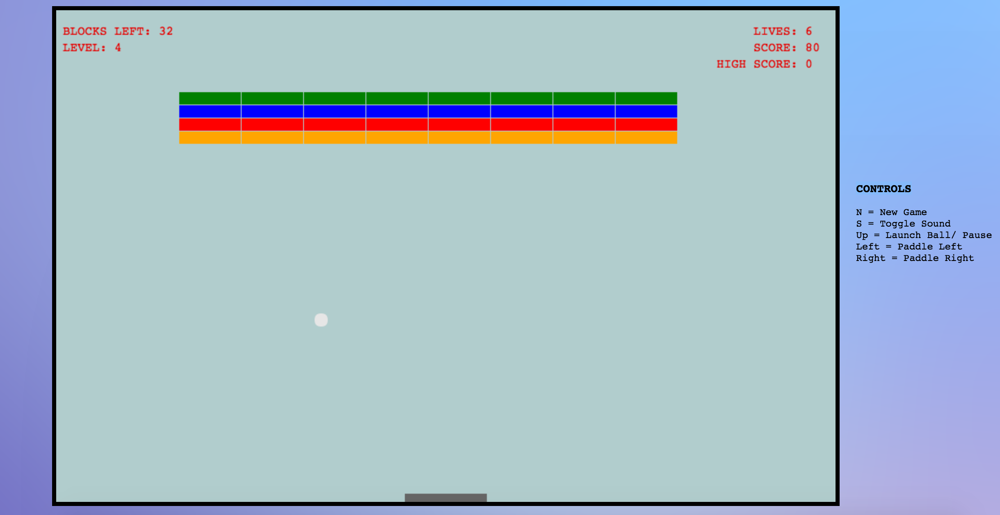

## Breakout

[Breakout! Live][breakout]

[breakout]: https://mttmcgrgr.github.io/breakout/

Breakout! is a variation on the 1972 Atari by Steve Wozniak. The player
progresses through a series of increasingly difficult levels to obtain the
highest score possible by breaking blocks and keeping the ball
in bounds using the paddle.

### Levels and Score

Bricks are assigned a point value according to their row (row 1 blocks = 1 point, etc.) Players will move on to the next level when all blocks have been cleared. Each subsequent level adjusts the speed of the ball, adds another row
to the blocks and slightly decreased the width of the paddle. 1 extra life is also given to the player at the start of each level.

### Player Statistics

The following stats are tracked during play:

- "Blocks Left" - keeps track of the remaining number of blocks in current  level

- "Level" - the current level

- "Lives" - the player starts the game with 3 lives and can earn more by progressing to a
            higher level

- "Score" - total points accumulated through breaking of blocks of various
            point values

- "High Score" - record of the highest score until page is closed or refreshed

### Collision Detection

On each rendering of the canvas, blocks are iterated through and compared against the
current position of the ball. If the ball falls within the paramters of the block, the
block's "destroyed" attribute is change from false to true, the "points" value of the block is added to the score and the ball's trajectory on each frame is reversed. On the following render, the drawBlocks method only renders blocks with a "destroyed" value of false to the canvas.

### Future Additions

I plan to add collectible upgrades including paddle width increase, multiple balls
and "catching" of the ball with the paddle to align a shot.
